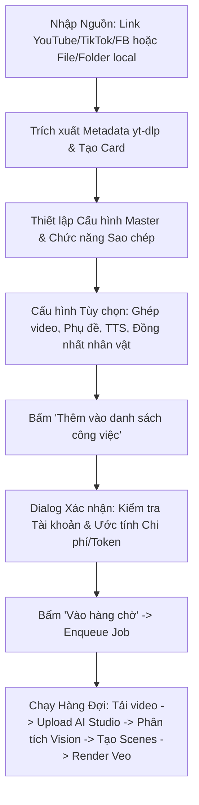

# CHI TIẾT LOGIC TAB "CLONE VIDEO" TRÍCH XUẤT TỪ HỆ THỐNG TRỢ GIÚP (UI GUIDE) VEOFLOW PRO MAX

## 1. Vị trí và cơ chế nút "Trợ giúp" (Biểu tượng bóng đèn 💡)

### 1.1. Vị trí trong giao diện (QML)
Nút "Trợ giúp" được định nghĩa tại **`H:\veo-tool\unpack-veotool\VEOFLOWPROMAX.exe_extracted\PYZ.pyz_extracted\qml\components\HeaderComponent.qml`**:
- **Dòng 598 - 605**:
  ```qml
  HeaderToolButton {
      actionId: "header.help"
      tone: "indigo"
      iconName: "light-bulb"
      text: (void i18n.revision, i18n.t("qml.header.help", "Trợ giúp"))
      tooltip: (void i18n.revision, i18n.t("qml.header.help_tooltip", "Hướng dẫn · Wiki · YouTube · Giới thiệu"))
      onClicked: helpMenu.popup()
  }
  ```
- Biểu tượng `light-bulb` (bóng đèn 💡) được đăng ký trong `AppIconRegistry.js`:
  ```javascript
  "💡": "light-bulb",
  "light-bulb": "#7C3AED",
  ```

### 1.2. Cơ chế kích hoạt hướng dẫn
Khi người dùng bấm vào nút Trợ giúp, menu `helpMenu` (dòng 816 - 868 của `HeaderComponent.qml`) mở ra:
```qml
HelpMenuItem {
    text: "Hướng dẫn đầy đủ (tự động)"
    glyph: "rocket"
    onTriggered: root.autoGuideRequested()
}
HelpMenuItem {
    text: "Hướng dẫn từng tab"
    glyph: "magic-wand"
    onTriggered: root.guideRequested()
}
HelpMenuItem {
    text: "Xem lại lời chào"
    glyph: "light-bulb"
    onTriggered: root.welcomeRequested()
}
```
Tại `App.qml` (dòng 1375 - 1376):
- `onGuideRequested: window.startGuidePick()`
- `onAutoGuideRequested: window.startAutoPlay()`
- Khi tab hiện tại là Clone Video (`route === "clone"`), hàm `startTabTour("clone")` gọi:
  ```javascript
  var steps = TourData.stepsFor("clone")
  ```
  Dữ liệu các bước hướng dẫn được nạp trực tiếp từ **`qml/components/TourData.js`** và hiển thị từng bước qua `TourOverlay.qml`.

---

## 2. Trích xuất toàn bộ nội dung hướng dẫn cho Clone Video

Toàn bộ nội dung tour hướng dẫn của tab Clone Video trong `TourData.js` gồm 2 phần: **Cấu hình thanh Master (Dùng chung)** và **Quy trình chi tiết của Clone Video**:

### 2.1. Cấu hình thanh Master (`COMMON_INTRO`)
1. **Bảng cấu hình (`masterConfigPanel`)**:
   > *"Thanh trên cùng: cấu hình CHUNG cho mọi video sắp tạo — các tab đều dùng chung thanh này. Video thêm vào hàng chờ sẽ mang cấu hình đang chọn lúc đó; từng dòng vẫn chỉnh riêng được sau."*
2. **Tỉ lệ khung hình (`cfgAspect`)**:
   > *"16:9 (ngang · YouTube), 9:16 (dọc · TikTok/Reels), 1:1 (vuông). Chọn theo nền tảng định đăng. Đổi tỉ lệ chỉ áp cho video THÊM SAU — dòng đã trong hàng chờ giữ tỉ lệ lúc thêm (chỉnh riêng ở bảng hàng chờ nếu cần)."*
3. **Chất lượng (`cfgQuality`)**:
   > *"Độ phân giải video xuất (720p / 1080p...). Cao hơn = nét hơn nhưng tốn credit và render lâu hơn. Mẹo: để vừa phải cho nhanh — cảnh nào ưng thì nâng nét riêng bằng nút Re-Upscale ở Bảng Job sau khi tạo xong."*
4. **Chọn Model AI (`cfgModel`)**:
   > *"Model tạo video (Veo 3, Veo 2...). Model mới chuyển động đẹp và bám mô tả tốt hơn; chi phí credit mỗi cảnh khác nhau theo model. Ảnh hưởng mọi cảnh sắp render của mọi tab."*
5. **Thư mục lưu (`master.config.folder_picker`)**:
   > *"Nơi lưu video xuất ra trên máy. Các nút 'Mở thư mục' ở hàng chờ / Bảng Job sẽ mở đúng chỗ này."*
6. **Chọn Style (`master.config.style_manager`)**:
   > *"Gắn phong cách (góc máy + chất liệu hình ảnh) áp THỐNG NHẤT cho mọi cảnh của video — đây là thứ quyết định 'chất phim'. Đổi style chỉ ảnh hưởng video thêm sau. Riêng tab Clone: không chọn = tự theo style video gốc."*
7. **Thị trường (`cfgMarket`)**:
   > *"Thị trường mục tiêu (ngôn ngữ · văn hoá): AI viết kịch bản, lời thoại và cách kể hợp khán giả nước đó. Đổi thị trường = đổi cả NGÔN NGỮ nội dung của video thêm sau."*
8. **Độ dài clip (`cfgClipDuration`)**:
   > *"Thời lượng MỖI CẢNH model render (8s, 16s...). Cảnh dài hơn mức model hỗ trợ sẽ tự CHAIN nhiều đoạn nối liền mạch — đổi lại tốn credit theo số đoạn. Video ngắn nhịp nhanh: để 8s là đẹp."*

---

### 2.2. Chi tiết các bước trong tab Clone Video (`TourData.js: "clone"`)

| STT | Bước / Thành phần | Tiêu đề | Nội dung hướng dẫn chi tiết từ UI |
|---|---|---|---|
| 1 | `cloneOutputMode` | **Chọn loại đầu ra** | *"Ở hàng cấu hình Master: Tự động để AI quyết định, Ảnh để tạo chuỗi ảnh kể chuyện, hoặc Video để luôn tạo clip động. Hàng này cũng chứa model/clip/nhịp ảnh theo nhánh đang chọn."* |
| 2 | `cfgCloneDialogueLanguage` | **Ngôn ngữ lời thoại đầu ra** | *"Nằm cạnh Thị trường trên MasterConfig. Giá trị tự đồng bộ theo market nhưng vẫn đổi riêng được tại đây."* |
| 3 | `work_panel.clone_creative_original` | **Copy gốc — tái tạo 1:1** | *"Clone lại y hệt video gốc — giữ nguyên câu chuyện, lời thoại, hình ảnh."* |
| 4 | `work_panel.clone_creative_remix` | **Giữ chuyện, đổi vỏ** | *"Cốt truyện & lời thoại y nguyên — chỉ thay nhân vật / bối cảnh / style hình / sản phẩm bằng chip công thức bên dưới."* |
| 5 | `work_panel.clone_creative_create` | **Giữ công thức, chuyện mới** | *"AI học hook + cấu trúc + nhịp viral của video gốc rồi viết nội dung hoàn toàn mới theo chủ đề bạn điền."* |
| 6 | `work_panel.clone_creative_series` | **Tập tiếp theo (series)** | *"Giữ NGUYÊN dàn nhân vật & thế giới của video gốc — AI viết tập mới với tình huống mới. Hợp kênh nuôi nhân vật dài tập."* |
| 7 | `remixInstructionsInput` | **Yêu cầu riêng cho chế độ Clone** | *"Ô một dòng dùng phần trống ngay trong hàng Sao chép. Có thể để trống để AI chạy công thức chuẩn; khi nhập, nội dung này trở thành ràng buộc ưu tiên. Trên màn hình hẹp, ô này thu thành nút Yêu cầu thêm."* |
| 8 | `work_panel.clone_draw_toggle` | **Bật/tắt Draw cho đầu ra Ảnh / Tự động** | *"Công tắc Draw nằm ở nửa ẢNH của hàng Đầu ra trên MasterConfig. Bật/tắt ngay tại đây, không cần mở dialog. Khi bật, mọi cảnh ảnh đi qua pipeline Draw (với Tự động chỉ khi hệ thống phân loại ra Ảnh)."* |
| 9 | `work_panel.clone_draw_settings` | **Cấu hình Draw (style / tay)** | *"Nút Cấu hình chỉ bật khi Draw đang ON. Mở Style Manager bucket Draw để chọn Draw Style, actor và tay/bút — không dùng để tắt Draw."* |
| 10 | `work_panel.clone_char_consistency` | **Điều khiển nhân vật · đồ vật · bối cảnh** | *"Mở hoặc thu gọn bảng đồng nhất. Chỉ số N/3 là số nhóm đang hoạt động; rất hữu ích khi Đổi vỏ hoặc làm Tập tiếp theo bằng nhân vật và bối cảnh riêng của bạn."* |
| 11 | `work_panel.clone_auto_merge` | **Tự động ghép video** | *"Nối các cảnh clone thành 1 video hoàn chỉnh sau khi xong."* |
| 12 | `cloneNarrationVoice` | **Giọng kể cho Clone ảnh** | *"TTS chỉ dùng khi video gốc có giọng kể chuyện. Clone kế thừa cấu hình chung và cho phép chọn nhanh provider/giọng; nghe thử và tùy chỉnh sâu được quản lý trong Voice Studio."* |
| 13 | `LIBRARY_CONTROL` | **Đồng nhất thực thể (Nhân vật, Đồ vật, Bối cảnh)** | - **Nhân vật**: AI tạo · AI + Thư viện · Chỉ Thư viện · Không đồng nhất.<br>- **Đồng bộ giọng nhân vật**: Giữ đúng giọng nhân vật qua các cảnh (voice lock).<br>- **Tự động lưu nhân vật (`clone.creative_autosave`)**: Nhân vật do AI tạo sẽ tự lưu vào Media Library để video sau tái sử dụng. |
| 14 | `work_panel.clone_video_files` | **Chọn file video từ máy** | *"Chọn một hoặc nhiều video local đưa vào cùng danh sách nguồn. Không cần upload trước; job tự upload khi chạy."* |
| 15 | `work_panel.clone_video_folder` | **Chọn cả thư mục video** | *"Quét một thư mục và thêm toàn bộ file video phù hợp vào danh sách nguồn trong một lần."* |
| 16 | `work_panel.clone_login_platform` | **Đăng nhập nền tảng** | *"Đăng nhập bằng cookie để tải được video riêng tư / giới hạn khu vực."* |
| 17 | `cloneUrlInput` | **Nguồn video: link và file chung một bảng** | *"Dán link YouTube, TikTok, Facebook hoặc Instagram, mỗi dòng một link; hệ thống tự lấy thông tin khi bạn ngừng gõ. Bạn cũng có thể kéo-thả file vào toàn bộ khung nguồn."* |
| 18 | `cloneSourceList` | **Danh sách nguồn đã nhận** | *"Link và file local cùng nằm tại đây. Chọn từng dòng, kiểm tra trạng thái và dùng Config Override nếu một nguồn cần cấu hình riêng."* |
| 19 | `work_panel.clone_select_all` | **Chọn nhanh toàn bộ nguồn** | *"Chọn tất cả các nguồn đang hiển thị; có thể dùng Deselect bên cạnh hoặc bỏ chọn riêng từng dòng trước khi đưa sang danh sách công việc."* |
| 20 | `work_panel.clone_submit_worklist` | **Thêm vào danh sách công việc** | *"Đưa đúng các nguồn đang chọn qua bước xác nhận rồi vào hàng đợi Clone. Nếu vừa dán link và danh sách chưa kịp hiện, nút này sẽ kích hoạt lấy thông tin link trước."* |
| 21 | `work_panel.start_queue` | **Bắt đầu Clone** | *"Nút Clone nằm ở đầu khung hàng đợi. Nó chạy chuỗi tải hoặc upload nguồn, phân tích, rồi tạo đầu ra theo chế độ và cấu hình đã chọn."* |
| 22 | `cloneQueueList` | **Theo dõi hàng đợi Clone** | *"Mỗi dòng cho biết nguồn, đầu ra/model, chất lượng, style, ngôn ngữ và tiến trình. Các thao tác trên dòng chỉ tác động đúng job đó."* |

---

## 3. Suy luận toàn bộ logic hoạt động của tab Clone Video

Dựa trên hướng dẫn UI và mã nguồn trích xuất, quy trình xử lý Clone Video diễn ra theo 5 giai đoạn:



### 3.1. Giai đoạn 1: Thu thập nguồn (Input Ingestion)
- Hỗ trợ nguồn linh hoạt:
  - Link đơn hoặc danh sách link nhiều dòng (YouTube, TikTok, Facebook Reel, Instagram).
  - Chọn file lẻ (`work_panel.clone_video_files`) hoặc cả thư mục (`work_panel.clone_video_folder`).
  - Kéo-thả trực tiếp (Drag & Drop) vào vùng `DropArea`.
- Tự động nhận diện nền tảng (`cloneInputPlatform`) và debounce 150ms-800ms để kích hoạt `yt-dlp` lấy tiêu đề, thời lượng thực, lượt xem mà không cần user bấm tìm.

### 3.2. Giai đoạn 2: Lựa chọn 4 chế độ sao chép (Creative Modes)
1. **Original (`original`)**: Tái tạo 1:1, bám sát toàn bộ lời thoại, góc máy, nhịp dựng. Ô ghi chú là `copy_focus` (yêu cầu điểm cần ưu tiên).
2. **Remix (`remix`)**: Giữ cốt truyện + nhịp + lời thoại; thay nhân vật, bối cảnh, style. Ô ghi chú là `direction` (hướng muốn đổi).
3. **Creative (`creative`)**: Học công thức hook viral + nhịp kể của video gốc để viết truyện mới hoàn toàn. Ô ghi chú là `topic` (chủ đề mới).
4. **Series (`series`)**: Giữ cố định dàn nhân vật và thế giới của video gốc; sáng tạo tình huống tiếp theo cho tập mới. Ô ghi chú là `situation` (tình huống tập mới).

### 3.3. Giai đoạn 3: Thiết lập các pipeline phụ trợ
- **Tự động ghép video (`auto_merge`)**: Nối các clip render rời rạc (mỗi clip 8s/16s) thành 1 video liền mạch kèm audio.
- **Phụ đề (`SubtitleStudio`)**: Tự động sinh phụ đề đa ngôn ngữ theo `subtitle_profile` và ngôn ngữ thoại đã chọn.
- **Narrator TTS**: Phát hiện narrator trong video gốc để sinh audio đọc thay thế hoặc giữ nguyên hội thoại tự nhiên của nhân vật.
- **Character Consistency (Ma trận đồng nhất)**: Quản lý nhân vật, đạo cụ, bối cảnh giữa các cảnh để tránh nhân vật bị đổi mặt/đổi đồ.

### 3.4. Giai đoạn 4: Xác thực và vào hàng chờ (Preflight Check & Enqueue)
- Bấm **"Thêm vào danh sách công việc"** (`submit_worklist`) -> Gọi `workPanelController.requestQueueCost("clone")`.
- Hộp thoại `QueuePreflightDialog` xuất hiện:
  - Kiểm tra `liveAccountCount() > 0` (bắt buộc phải có tài khoản).
  - Kiểm tra số dư credit/tiền khả dụng (`_moneyOk()`).
  - Hiển thị tóm tắt cấu hình (`buildConfigRows()`).
  - Hiển thị chi phí ước tính theo từng video (`status: "ready"`).
- Bấm **"Vào hàng chờ"** -> Gọi `submitCloneCardsWithConfig(cards)`.
  - Cập nhật `_queue_rows`.
  - Gọi `_queue_model.apply_rows()`.
  - Phát tín hiệu `queueRowsChanged` và `statsChanged`. Job hiển thị ngay trên bảng "JOB ĐANG CHẠY / Chờ xử lý".

### 3.5. Giai đoạn 5: Thực thi hàng đợi (Backend Pipeline Execution)
- Khi hàng chờ chạy (`start_queue`):
  1. Tải video gốc (nếu là link online) hoặc chuẩn bị file local.
  2. Upload video lên Google AI Studio Drive (`https://content.googleapis.com/upload/drive/v3/files?uploadType=resumable`).
  3. Gửi video vào mô hình Gemini Vision kèm system prompt phân tích (phân đoạn cảnh theo `clip_duration_seconds`, trích xuất Entity Library).
  4. Tạo kịch bản phân cảnh chi tiết (Prompt Veo 3 / Veo 2 cho từng cảnh).
  5. Đẩy từng cảnh vào hàng đợi render video Veo.
  6. Ghép file kết quả cuối cùng vào `output_folder`.

---

## 4. Danh sách các file Python và hàm tương ứng

| File Python | Lớp / Hàm | Vai trò kỹ thuật trong luồng Clone |
|---|---|---|
| `qml_app/controllers/work_panel_controller.py` | `WorkPanelController.requestQueueCost` | Tính toán số cảnh, token, chi phí ước tính và emit `queueCostChanged` |
| `qml_app/controllers/work_panel_controller.py` | `WorkPanelController.submitCloneCardsWithConfig` | Đưa danh sách thẻ clone đã duyệt qua bước xác nhận vào hàng chờ |
| `qml_app/controllers/work_panel_controller.py` | `WorkPanelController._start_clone_auto_fetch` | Khởi động thread chạy `yt-dlp` lấy metadata khi user dán URL |
| `qml_app/controllers/work_panel_controller.py` | `WorkPanelController.cloneCardConfigSummary` | Trả về tóm tắt cấu hình (model, style, aspect, quality, language) cho từng thẻ |
| `application/work_panel/clone.py` | `CloneUseCases.fetch_clone_videos_for_entry` | Trích xuất thông tin video từ YouTube/TikTok bằng `yt-dlp` |
| `application/work_panel/clone.py` | `CloneUseCases.build_clone_card_from_video` | Khởi tạo dictionary card đầy đủ để hiển thị lên bảng nguồn của QML |
| `application/clone_service.py` | `CloneService.add_to_queue` | Service quản lý bộ nhớ hàng chờ, cấp phát `row_id`, đếm tổng job |
| `services/tabs/clone_video/youtube_clone_service.py` | `YouTubeCloneService.clone_video` | Hàm điều phối chính: tải nguồn, upload media, gọi AI phân tích |
| `services/tabs/clone_video/youtube_clone_service.py` | `YouTubeCloneService._analyze_and_clone_video` | Ghép system prompt (Original/Remix/Creative/Series) và gọi AI Vision |
| `services/tabs/clone_video/youtube_clone_service.py` | `YouTubeCloneService.upload_video_file` | Upload video lên Google AI Studio Drive qua resumable session |
| `services/tabs/clone_video/batch_generation_service.py` | `BatchGenerationService.generate_variation` | Tạo các biến thể nội dung từ motif video gốc |
| `services/tabs/clone_video/clone_image_timeline.py` | `CloneImageTimelineOrchestrator` | Xử lý kịch bản ảnh và ghép nhịp timeline khi đầu ra là Ảnh (Storyboard) |
| `services/tabs/clone_video/narration_policy.py` | `resolve_narration_policy` | Quyết định chính sách bật/tắt giọng đọc TTS theo đặc điểm video gốc |

---

## 5. Danh mục các tùy chọn và giải thích chi tiết

1. **Đầu ra (`output_mode`)**:
   - `auto`: AI tự quyết định dạng Video hay chuỗi Ảnh dựa trên nội dung nguồn.
   - `video`: Luôn tạo các clip động hoàn chỉnh.
   - `image`: Dựng chuỗi ảnh kể chuyện (tiết kiệm credit).
2. **Chức năng sao chép (`creative_mode`)**:
   - `original`: Giữ nguyên 100% nội dung gốc.
   - `remix`: Giữ cốt truyện, đổi nhân vật, bối cảnh, style.
   - `creative`: Giữ công thức hook + nhịp kể, viết truyện mới.
   - `series`: Giữ dàn nhân vật, viết tiếp tập mới.
3. **Tỷ lệ khung hình (`aspect_ratio`)**:
   - `16:9`: Dành cho YouTube ngang, TV, màn hình máy tính.
   - `9:16`: Dành cho TikTok, Shorts, Facebook Reels.
   - `1:1`: Dành cho bài post Instagram, Facebook Feed vuông.
4. **Chất lượng (`quality` / `resolution`)**:
   - `720p`: Render nhanh, tiết kiệm credit (khuyên dùng lúc draft).
   - `1080p`: Độ phân giải cao, sắc nét, tốn credit hơn.
5. **Độ dài mỗi cảnh (`clip_duration_seconds`)**:
   - `8s`: Tiêu chuẩn cho nhịp video nhanh, bám prompt tốt nhất.
   - `16s` hoặc dài hơn: Tự động chain nối đoạn, tốn credit theo cấp số.
6. **Thị trường (`target_market`) & Ngôn ngữ (`voice_language`)**:
   - Thị trường (global, vi, us, jp, kr...): AI viết nội dung hợp văn hóa bản địa.
   - Ngôn ngữ thoại tự đồng bộ theo thị trường nhưng có thể tùy biến độc lập.
7. **Đồng nhất nhân vật (`char_consistency`)**:
   - Cho phép chọn nguồn nhân vật từ AI hoặc Media Library (ảnh tham chiếu).
   - Tự động lưu nhân vật vào thư viện (`creative_autosave`) để dùng cho các video sau.
